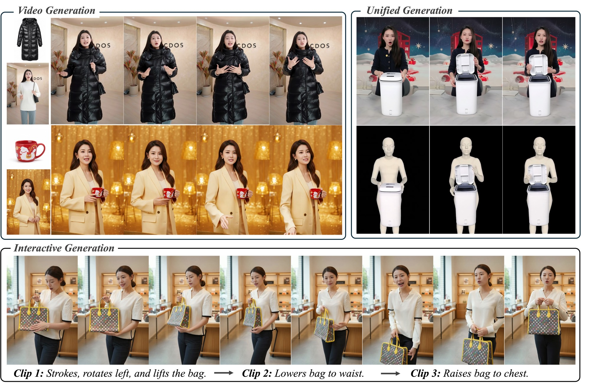
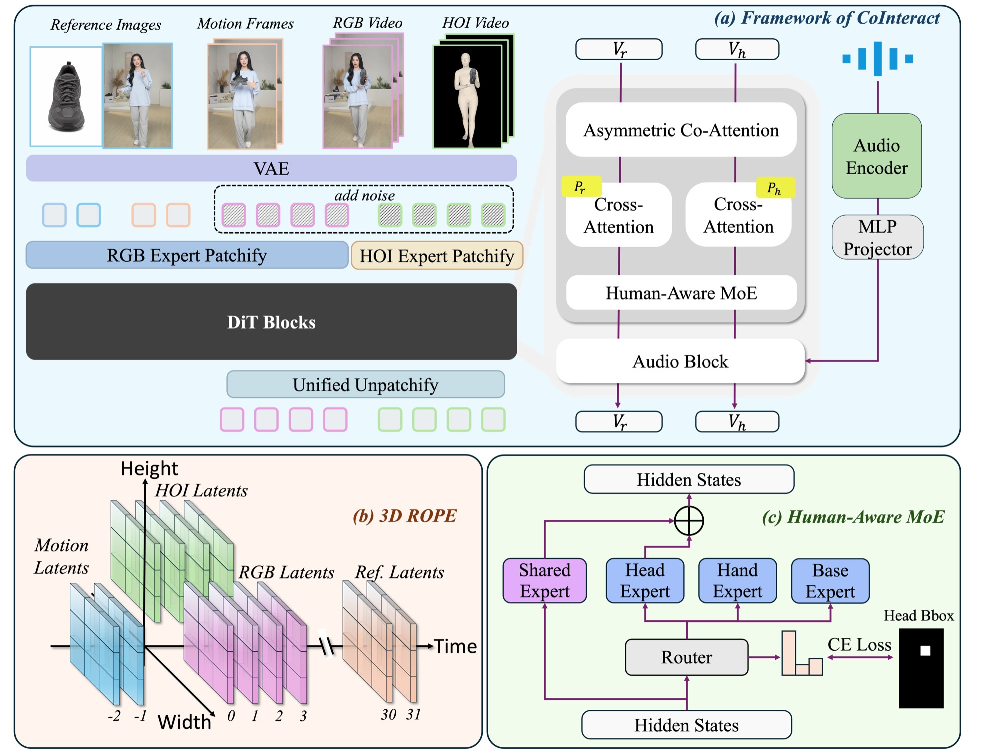

<h1 align="center">CoInteract: Spatially-Structured Co-Generation for Interactive Human-Object Video Synthesis</h1>

<p align="center">
  Xiangyang Luo<sup>1,2*</sup>, Xiaozhe Xin<sup>2*✉</sup>, Tao Feng<sup>1</sup>, Xu Guo<sup>1</sup>, Meiguang Jin<sup>2</sup>, Junfeng Ma<sup>2</sup>
  <br>
  <sup>1</sup> Tsinghua University &nbsp; <sup>2</sup> Alibaba Group
  <br>
  <sup>*</sup> Equal contribution &nbsp; <sup>✉</sup> Corresponding author
</p>

<p align="center">
  <a href="https://arxiv.org/abs/2604.19636"></a>
  <a href="https://huggingface.co/georgexin/cointeract"></a>
  <a href="https://xinxiaozhe12345.github.io/CoInteract_Project/"></a>
</p>

## Demob
<p align="center">
  <video src="https://github.com/user-attachments/assets/fe59a768-38e8-4403-bd13-155662c628d6" controls width="80%"></video>
</p>

## 🔥News

- [April 27, 2026] We release the inference code and checkpoint of CoInteract.
- [April 22, 2026] We release the [Paper](https://arxiv.org/abs/2604.19636) and [Project](https://xinxiaozhe12345.github.io/CoInteract_Project/) page of CoInteract.

## 🗺️Roadmap

| Stage | Status | Description | Date |
|-------|--------|-------------|------|
| 1 | ✅ | Release inference code and model weights | - |
| 2 | 🔜 | Release training code | 2026-05-06 |
| 3 | 📋 | Add pose control support | 2026-05-06 |

## Installation

```bash
git clone https://github.com/luoxyhappy/CoInteract.git
cd CoInteract
conda create -n cointeract python=3.10
pip install -e .
```

### Model Weights

We rely on two base models plus our CoInteract checkpoint. The easiest way to fetch everything is the HuggingFace CLI:

```bash
# Wan2.2-S2V-14B base model
hf download Wan-AI/Wan2.2-S2V-14B \
    --local-dir ./models/Wan2.2-S2V-14B

# Chinese Wav2Vec2 audio encoder
hf download jonatasgrosman/wav2vec2-large-xlsr-53-chinese-zh-cn \
    --local-dir ./models/chinese-wav2vec2-large

# CoInteract checkpoint 
hf download georgexin/cointeract \
    --local-dir ./models/CoInteract
```

<details>
<summary><b>Note: alternative endpoint for restricted networks</b></summary>

If `huggingface.co` is unreachable from your environment, configure the community mirror before running the download commands:

```bash
export HF_ENDPOINT=https://hf-mirror.com
```

To persist this setting, append the line to `~/.bashrc` or `~/.zshrc`.

</details>

| Model | Link |
|-------|------|
| Wan2.2-S2V-14B | [Wan-AI/Wan2.2-S2V-14B](https://huggingface.co/Wan-AI/Wan2.2-S2V-14B) |
| Chinese Wav2Vec2 Large | [jonatasgrosman/wav2vec2-large-xlsr-53-chinese-zh-cn](https://huggingface.co/jonatasgrosman/wav2vec2-large-xlsr-53-chinese-zh-cn) |
| CoInteract Checkpoint | [georgexin/cointeract](https://huggingface.co/georgexin/cointeract/tree/main) |

## Inference

Run batch inference with the default demos CSV (paths resolve under `./models/`):

```bash
python batch_infer.py \
    --csv_path ./examples/demos/demos.csv \
    --output_dir ./output_videos \
    --height 1280 \
    --width 720 \
    --cfg_scale 7.0 \
    --num_clips 3
```

We recommend running at **720p** (`--height 1280 --width 720`) for the best visual quality. A lower-resolution **480p** setting (`--height 832 --width 480`) is available for memory-constrained GPUs.

| Resolution | Height × Width | Peak GPU Memory |
|------------|----------------|-----------------|
| 720p (recommended) | 1280 × 720 | ~59 GB |
| 480p | 832 × 480 | ~45 GB |

Input CSV must contain columns `audio`, `person_image`, `prompt`. Optional columns: `product_image`, `prompt2`, `prompt3`.

- `person_image`: path to the reference image of the speaker (identity / first frame).
- `product_image`: path to the product reference image (object appearance). Leave empty for pure speech-driven generation.
- `prompt2`, `prompt3`: optional per-clip prompts used for **interactive generation**, allowing different textual instructions across sequential clips to drive multi-turn interactions.

We provide our generated results for the demos in [`./output_videos`](./output_videos) for reference.

> **Notes.** If you want to try your own cases, we recommend using product images with a clean white background for best results, and keeping your prompt in a format consistent with the examples provided in [`./examples/demos/demos.csv`](./examples/demos/demos.csv).

## ✨Highlights

CoInteract enables high-quality **speech-driven human-object interaction video synthesis** with fine-grained spatial control. It supports diverse generation modes including video generation, unified generation, and interactive generation.

<p align="center">
  
</p>

Key contributions:

- **Human-Aware Mixture-of-Experts (MoE)**: A spatial routing mechanism that dynamically dispatches tokens to specialized expert networks, supervised by GT bounding boxes during training and fully automatic at inference.
- **Spatially-Structured Co-Generation**: Joint training of RGB video and HOI depth maps provides structural guidance for realistic interactions, without requiring depth input at inference time.


<p align="center">
  
</p>

## Citation

```bibtex
@article{luo2026cointeract,
  title={CoInteract: Physically-Consistent Human-Object Interaction Video Synthesis via Spatially-Structured Co-Generation},
  author={Luo, Xiangyang and Xin, Xiaozhe and Feng, Tao and Guo, Xu and Jin, Meiguang and Ma, Junfeng},
  journal={arXiv preprint arXiv:2604.19636},
  year={2026}
}
```

## Acknowledgments

- [DiffSynth-Studio](https://github.com/modelscope/DiffSynth-Studio)
- [Wan2.2](https://github.com/Wan-Video/Wan2.2)

## License

This project is released under the [Apache License 2.0](./LICENSE). Note that the underlying base models (e.g., [Wan2.2-S2V-14B](https://huggingface.co/Wan-AI/Wan2.2-S2V-14B) and [jonatasgrosman/wav2vec2-large-xlsr-53-chinese-zh-cn](https://huggingface.co/jonatasgrosman/wav2vec2-large-xlsr-53-chinese-zh-cn)) are governed by their own licenses; please comply with them when using the corresponding weights.
